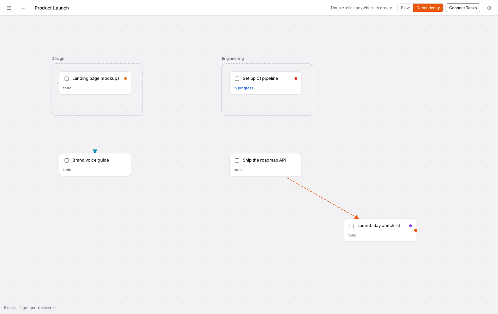
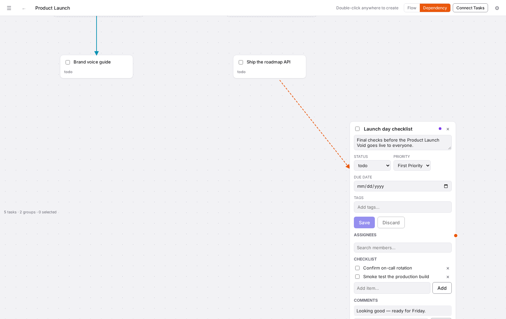
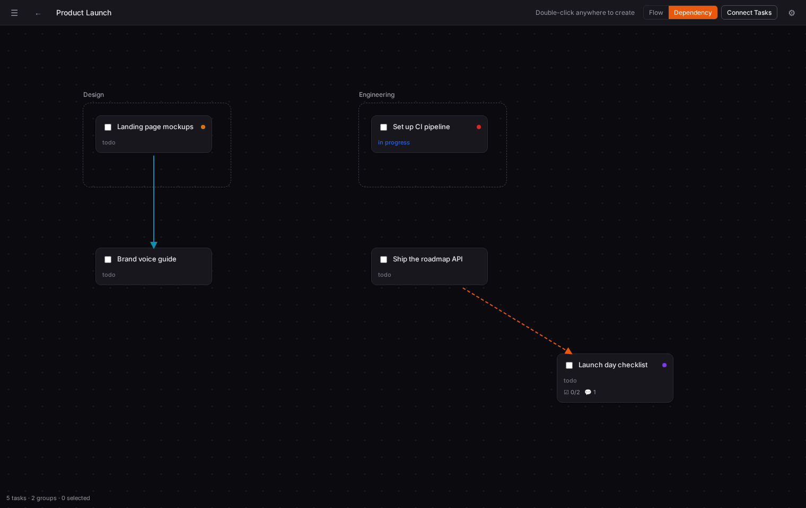
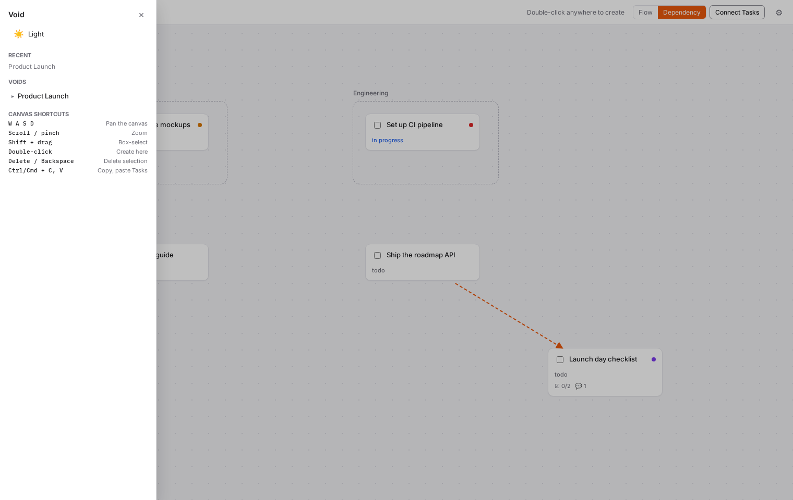
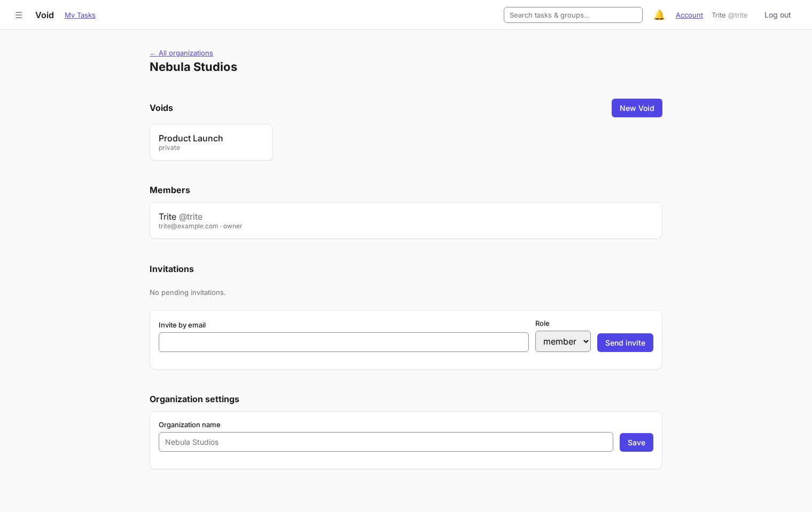

<div align="center">
  

  <p><strong>Task management as a place, not a list — an infinite spatial canvas where work lives where you put it.</strong></p>

  <p>
    <a href="https://github.com/CastielJ/TheVoid/actions/workflows/ci.yml"></a>
    <a href="LICENSE"></a>
    = 22">
    
    <a href="CONTRIBUTING.md"></a>
  </p>

  <p>
    <a href="https://e-z.bio/trite"><strong>e-z.bio/trite</strong></a>
  </p>

  <br />

  
</div>

---

Most task tools force everything into rows and columns. Void doesn't: work
lives on an infinite pan-and-zoom canvas, exactly where you drop it. Cluster
related work into **Groups** that auto-size around their **Tasks**, connect
Tasks to each other with directional **Task Link** arrows, zoom out for the
whole board, zoom in to get precise — with every change syncing live to
everyone else looking at the same canvas.

Organizations contain **Voids** — self-contained workspaces, each with their
own canvas. A Void can nest under another Void to form a **Team** (its own
membership and visibility, exactly like a subdirectory), so a company can
model "Engineering" and "Design" as spaces inside a shared "Product Launch"
Void — or keep them fully independent. Whatever matches how the team
actually works.

## Contents

- [Features](#features)
- [More screenshots](#more-screenshots)
- [Tech stack](#tech-stack)
- [Getting started](#getting-started)
- [Project structure](#project-structure)
- [Architecture highlights](#architecture-highlights)
- [Testing](#testing)
- [Contributing](#contributing)
- [Security](#security)
- [Author](#author)
- [License](#license)

## Features

- **Spatial canvas** — infinite pan/zoom, WASD + mouse navigation,
  box-select, copy/paste, drag-to-reposition, virtualized rendering that
  stays smooth at ~1,500+ objects per Void.
- **Task Links** — connect Tasks with directional arrows: drag a connector
  handle between two cards, or arm a toolbar button and click source then
  target. **Flow** links are a visual suggested order; **dependency**
  links are enforced — a Task can't be marked done while one it depends on
  isn't.
- **Auto-sizing Groups** — a tight bounding box the server recomputes over
  its member Tasks, with a live preview while you drag a Task in or out.
  Never manually resized.
- **Fully inline task editing** — click a Task to expand it in place:
  description, status, priority, due date, tags, multi-assignee, checklist,
  threaded comments, all on the card itself, with a guard against losing
  unsaved edits.
- **Mutations that tell you what's happening** — a real pending state (a
  spinner, a dimmed card) until the server confirms, and a toast instead of
  silent failure when it doesn't.
- **Nested Voids ("Teams")** — independent membership and one of three
  visibility tiers per Void (public / private / invisible), with a real
  join-request workflow for private spaces.
- **Live realtime sync** — every Task/Group/Task-Link change broadcasts
  over WebSockets to everyone viewing that Void, last-write-wins.
- **Real light & dark themes**, synced server-side across devices —
  including the canvas workspace itself, not just the UI chrome.
- **Capability-based authorization** — every permission check is a named
  function (`canEditVoid`, `canManageVoidAccess`, …), never a hardcoded
  role string. Organization role never silently grants Void access.
- **Auth that doesn't cut corners** — email+password or magic-link login,
  optional TOTP 2FA with backup codes, breached-password checking (HIBP
  k-anonymity), per-device session management.
- **In-app notifications, search, and a cross-Void "My Tasks" view.**

## More screenshots

<table>
  <tr>
    <td width="50%">
      
      <p align="center"><em>Fully inline task editing — no side panel</em></p>
    </td>
    <td width="50%">
      
      <p align="center"><em>Real dark theme, canvas included</em></p>
    </td>
  </tr>
  <tr>
    <td width="50%">
      
      <p align="center"><em>Nested Voids/Teams navigation, theme toggle, recents</em></p>
    </td>
    <td width="50%">
      
      <p align="center"><em>Organization dashboard — Voids, members, invitations, settings</em></p>
    </td>
  </tr>
</table>

## Tech stack

| Layer        | Choice                                                                                                                                     |
| ------------ | ------------------------------------------------------------------------------------------------------------------------------------------ |
| Language     | TypeScript, end to end                                                                                                                     |
| Backend      | [Fastify](https://fastify.dev) + [tRPC](https://trpc.io) (fully typed client↔server, no REST/GraphQL schema to hand-maintain)              |
| ORM/Database | [Drizzle ORM](https://orm.drizzle.team) + PostgreSQL                                                                                       |
| Frontend     | React + [Vite](https://vitejs.dev)                                                                                                         |
| Client state | [Zustand](https://github.com/pmndrs/zustand) (canvas/object state) + [TanStack Query](https://tanstack.com/query) (server state, via tRPC) |
| Realtime     | Native WebSockets (`@fastify/websocket`), no external pub/sub required                                                                     |
| Testing      | [Vitest](https://vitest.dev) (unit/integration, both packages) + [Playwright](https://playwright.dev) (critical-path E2E)                  |
| Monorepo     | pnpm workspaces (`packages/shared`, `packages/server`, `packages/web`)                                                                     |

No Kubernetes, no message broker, no ORM-generated GraphQL schema to fight
with — boring and debuggable at this project's actual scale.

## Getting started

**Requirements:** Node.js 22+, pnpm, PostgreSQL 17 running locally.

```sh
git clone https://github.com/CastielJ/TheVoid.git void
cd void
pnpm install

cp packages/server/.env.example packages/server/.env
# edit packages/server/.env — at minimum set DATABASE_URL and SESSION_SECRET

pnpm db:migrate

pnpm dev:server   # Fastify + tRPC on :3000
pnpm dev:web      # Vite + React on :5173, in a second terminal
```

Open `http://localhost:5173` and sign up — fully usable from a freshly
migrated, empty database.

```sh
pnpm typecheck      # every package
pnpm lint
pnpm format         # write; use `format:check` in CI
pnpm test           # unit + integration, every package
pnpm --filter @void/web test:e2e   # Playwright critical-path suite

pnpm db:generate    # generate a Drizzle migration from a schema.ts change
pnpm db:migrate     # apply pending migrations
```

## Project structure

```
void/
├── packages/
│   ├── shared/    types and schemas shared by server and web
│   ├── server/    Fastify + tRPC + Drizzle backend
│   │   └── src/
│   │       ├── domains/       business logic, one folder per concept (void, task, group, auth, …)
│   │       ├── routers/       tRPC procedure definitions — thin, delegate to domains/
│   │       ├── authorization/ capability functions — the single source of truth for "can this user do X"
│   │       ├── realtime/      WebSocket handler + event broadcasting
│   │       └── db/            Drizzle schema + migrations
│   └── web/       React + Vite frontend
│       └── src/
│           ├── canvas/        the spatial canvas (viewport, cards, edges, store, spatial index)
│           ├── features/      page-level feature modules (org, void, auth, notifications, …)
│           ├── app/           app shell, left panel, theming, session
│           └── trpc/          typed tRPC client
├── assets/        logo and README screenshots
└── .github/       CI workflow, issue/PR templates
```

## Architecture highlights

- **Access is never inferred from role alone.** An Organization Owner/Admin
  does **not** automatically get access to every Void — access is always an
  explicit grant, with one narrow, documented exception (Void _deletion_).
- **Every mutation resolves its own parent IDs server-side.** A procedure
  acting on a child resource never trusts a client-supplied parent ID — it
  looks the real parent up from the resource itself.
- **Groups are server-computed, not client-resizable.** Bounds are a tight
  bounding box recomputed over member Tasks on every relevant mutation —
  no "my drag and your drag disagree" bugs.
- **A "Team" is just a Void.** `voids` is a self-referencing table —
  nesting is unlimited, and a nested Void gets its own canvas, membership,
  and visibility for free, with zero special-casing in the canvas code.
- **Task Links are real rows, not client-side decoration.** They live in
  Postgres, broadcast over the same WebSocket channel as Task/Group
  changes, and cascade-delete with either endpoint Task via explicit
  application logic in the same transaction — Task deletion is always a
  soft-delete, so a plain foreign-key cascade would never actually fire.
- **The canvas only does the work a change needs.** Dragging a card
  updates just that card's live position; the spatial index virtualization
  depends on is left alone until the drag settles, instead of rebuilding
  on every pointer-move frame.

## Testing

- **Unit + integration** (Vitest) — the authorization/capability layer has
  the highest-priority coverage: every capability function is tested for
  both the positive and negative case, against a real Postgres database.
- **Critical-path E2E** (Playwright) — drives the real app through a
  browser: signup → org → Void → nested Team → members → Groups/Tasks →
  assign work → authorized access and unauthorized denial → visibility +
  join-request flow.

CI ([`.github/workflows/ci.yml`](.github/workflows/ci.yml)) runs
`typecheck` → `lint` → `format:check` → migrations → `test` on every push
and pull request.

## Contributing

Contributions are welcome — see [`CONTRIBUTING.md`](CONTRIBUTING.md) for dev
setup, migration generation, pre-PR checks, and commit/PR conventions.
Please also read our [Code of Conduct](CODE_OF_CONDUCT.md).

## Security

Please report vulnerabilities privately — see [`SECURITY.md`](SECURITY.md).
Do not open a public issue for a security report.

## Author

Built and maintained by **Trite** — [e-z.bio/trite](https://e-z.bio/trite)

## License

MIT — see [`LICENSE`](LICENSE).
